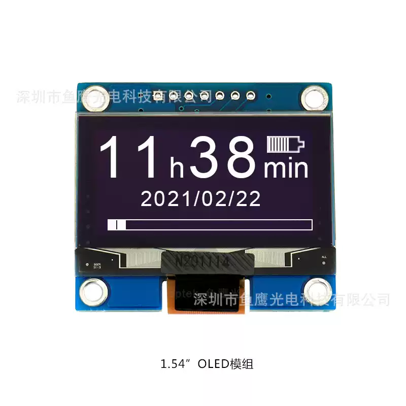

<p align="left"></p>

<h1 align="center">OSPTEK 1.54″ OLED 128×64 (SSD1309 · SPI)</h1>

<p align="center"><b>Monochrome OLED module · SPI · SSD1309</b></p>

<p align="center"><a href="./README.md">简体中文</a> | English</p>

<p align="center">
  
  
  
  
</p>

<p align="center"></p>

## Contents

- [Overview](#overview)
- [Specifications](#specifications)
- [Sample projects](#sample-projects)
- [Repository layout](#repository-layout)
- [Resources](#resources)
- [Buy](#buy)
- [Support](#support)

---

## Overview

OSPTEK **1.54″ 128×64 OLED** is a **SPI** monochrome display module driven by **SSD1309**. Suited to status bars, menus, debug text, and simple animations.

Spec ID (repository name): `1.54-oled-128x64-spi-ssd1309`

> Datasheets may list the driver as **SPD0301**. That is an alternate marking for the same chip family as **SSD1309** and is **fully software-compatible**; this repository uses the **SSD1309** name.

Current module version: **ODM154-12864W001-P7**. Screen details follow [`docs/OED154-12864W002-C24.pdf`](./docs/OED154-12864W002-C24.pdf); module details follow [`docs/ODM154-12864W001-P7.pdf`](./docs/ODM154-12864W001-P7.pdf).

## Specifications

| Item | Spec |
| ---- | ---- |
| Size | 1.54 inch |
| Type | OLED (monochrome) |
| Resolution | 128×64 |
| Interface | SPI (4-wire) |
| Driver IC | SSD1309 |

> Full outline, pinout, power, and electrical characteristics follow the product datasheet / driver IC datasheet.

## Sample projects

| Description | Path |
| ---- | ---- |
| ESP32-S3 · SSD1309 SPI bringup (animation demo) | [`examples/esp32s3-1.54-oled-128x64-spi-ssd1309-bringup/`](./examples/esp32s3-1.54-oled-128x64-spi-ssd1309-bringup/) |

## Repository layout

```text
1.54-oled-128x64-spi-ssd1309/
├── README.md
├── README_EN.md
├── MODULE_VERSION.md
├── LICENSE
├── images/          # README assets
├── docs/            # datasheets, init
└── examples/        # sample projects
```

## Resources

### Product files

| Resource | Link |
| ---- | ---- |
| Module datasheet (ODM154-12864W001-P7) | [`docs/ODM154-12864W001-P7.pdf`](./docs/ODM154-12864W001-P7.pdf) |
| Screen datasheet (OED154-12864W002-C24) | [`docs/OED154-12864W002-C24.pdf`](./docs/OED154-12864W002-C24.pdf) |
| Driver IC datasheet (SSD1309 / SPD0301) | [`docs/SPD_0301_0_1_d964ef5b8f.pdf`](./docs/SPD_0301_0_1_d964ef5b8f.pdf) |
| Init code | [`docs/1.54寸 2864初始化(spd0301).C`](./docs/1.54%E5%AF%B8%202864%E5%88%9D%E5%A7%8B%E5%8C%96%28spd0301%29.C) |

### Samples

- [ESP32-S3 SSD1309 SPI bringup](./examples/esp32s3-1.54-oled-128x64-spi-ssd1309-bringup/)

## Buy

<p align="center">
  <a href="https://www.aliexpress.com/store/1105701619"></a>
  &nbsp;&nbsp;
  <a href="https://shop110742373.taobao.com/"></a>
</p>

**Overseas (AliExpress)**

- Store: [OSPTEK Official Store](https://www.aliexpress.com/store/1105701619)

**China (Taobao)**

- Store: [鱼鹰光电工厂店](https://shop110742373.taobao.com/)

## Support

- Technical support / product inquiry: <luyu@osptek.com>
- QQ group (China): **985881096**
- Website: <https://osptek.com/>
- Feel free to open an Issue in this repository if you have any questions

---

<p align="center"><sub>© 2026 OSPTEK · Materials in this repository are licensed under CC BY 4.0</sub></p>
